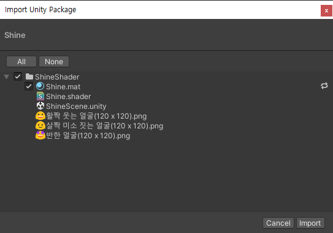

# ShineShader

## 소개


상점에서 많이보던 효과를 작성해보았음.
> 마치. 스님머리가 반짝반짝...


## Package preview


샘플이미지는 이모지를 사용함.
> 이모지에는 저작권이 없겠지...

# Shader Code.

```shader
Shader "Custom/Shine"
{
    Properties
    {
        _MainTex ("Texture", 2D) = "white" {}
        _Angle("Angle", Float) = 0
    }
    SubShader
    {
        Tags
        {
            "Queue" = "Transparent"
            "CanUseSpriteAtlas" = "True"
        }

        Blend SrcAlpha OneMinusSrcAlpha
        Pass
        {
            CGPROGRAM
            #pragma vertex vert
            #pragma fragment frag
            #pragma target 2.0
            #include "UnityCG.cginc"

            struct appdata
            {
                float4 vertex : POSITION;
                float2 uv : TEXCOORD0;
            };

            struct v2f
            {
                float2 uv : TEXCOORD0;
                float4 vertex : SV_POSITION;
            };

            sampler2D _MainTex;
            float4 _MainTex_ST;
            float _Angle;

            float2 rotateUV(float2 uv, float angle)
            {
                float radians = angle * UNITY_PI / 180.0;
                float s = sin(radians);
                float c = cos(radians);
                float2x2 rotationMatrix = float2x2(c, -s, s, c);
                uv -= 0.5;
                uv = mul(rotationMatrix, uv);
                uv += 0.5;
                return uv;
            }


            v2f vert(appdata v)
            {
                v2f o;
                o.vertex = UnityObjectToClipPos(v.vertex);
                o.uv = TRANSFORM_TEX(v.uv, _MainTex);
                return o;
            }

            fixed4 frag(v2f i) : SV_Target
            {
                fixed4 col = tex2D(_MainTex, i.uv);
                float2 rotatedUV = rotateUV(i.uv, _Angle);
                
                float sinValue = sin(2 * (_Time.y + rotatedUV.x));
                float smoothstepResult = smoothstep(0.9, 1.1, sinValue);
                float brightnessFactor = clamp(smoothstepResult, 0, 1);
                
                col.rgb += brightnessFactor;
                return col;
            }
            ENDCG
        }
    }
    Fallback "Sprites/Default"
}
```
